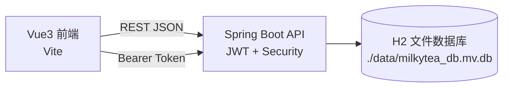

# MilkyTea 🥤 奶茶消费记录与统计系统（全栈）

一个前后端分离的个人记账/数据分析小项目：用 **Vue 3 + Vite** 做交互体验，用 **Spring Boot + JWT + H2** 提供安全、可持久化的 REST API。

---

## 项目亮点

1. **完整鉴权链路（JWT 7 天有效）**
	- 注册/登录拿 token → 前端统一存储/自动注入 `Authorization: Bearer <token>` → 后端 Spring Security 过滤器校验。
2. **手机号注册登录改造（真实需求驱动）**
	- 从“邮箱/用户名登录”切到“手机号登录”，包含：字段唯一性、DTO 校验规则、接口文档同步更新。
3. **统计能力 + 日历视图（业务价值清晰）**
	- 汇总统计（杯数/天数/金额/均价/评分）
	- 品牌统计（数量、金额、占比、均分）
	- 趋势分析（按 `day|week|month` 聚合）
	- 月度日历数据接口支撑“点日期看当天明细”。
4. **H2 文件数据库持久化（本地可复现、重启不丢）**
	- 默认将数据落到 `./data/milkytea_db.mv.db`，便于演示与调试。
5. **对“可维护性”的工程化处理**
	- 后端：Hibernate/JPA + 参数校验（Validation）+ 统一错误响应约定（见 API 文档）。
	- 前端：统一 `request` 层封装、友好错误提示映射，减少页面重复逻辑。

---

## 功能概览

- 用户：注册 / 登录 / 个人信息 / 修改用户名 / 修改密码
- 品牌：品牌列表（公开）/ 创建与删除
- 记录：增删改查、按日期/品牌/品类筛选
- 统计：汇总、品牌统计、趋势统计、月历数据

更多接口细节见：
- 后端接口文档：`backend/API文档.md`
- 手机号登录改造说明：`backend/手机号登录改造说明.md`

---

## 技术栈

**Frontend**
- Vue 3 + Vue Router
- Vite
- Fetch 封装（统一鉴权头、错误映射）

**Backend**
- Java 8, Spring Boot 2.7.x
- Spring Security + JWT（jjwt）
- Spring Data JPA
- H2（文件模式）
- springdoc-openapi（Swagger UI）

---

## 架构与数据流



---

## 快速开始（本地运行）

### 0) 环境要求

- Node.js >= 18
- JDK 8+（后端 `pom.xml` 已做版本约束）
- Maven（或使用 IDE 的 Maven 集成）

### 1) 启动后端（Spring Boot）

在仓库根目录执行：

```powershell
cd backend
mvn spring-boot:run
```

后端默认端口：`http://localhost:8080`

常用入口：
- Swagger UI：`http://localhost:8080/swagger-ui.html`
- H2 Console：`http://localhost:8080/h2-console`
  - JDBC URL：`jdbc:h2:file:./data/milkytea_db`
  - Username：`sa`
  - Password：空

### 2) 启动前端（Vue + Vite）

```powershell
cd frontend
npm install
npm run dev
```

前端默认地址：`http://localhost:5173`

前端请求后端的 BaseURL：
- 默认：`http://localhost:8080`
- 可通过环境变量覆盖：`VITE_API_BASE_URL`

---

## 调试与测试脚本（后端）

后端目录下提供了一些 PowerShell 脚本用于快速打接口：

```powershell
cd backend
./test-phone-auth.ps1
./test-statistics.ps1
```

更多脚本见 `backend/` 下 `test-*.ps1`。

---

## 目录结构

```text
MilkyTea/
  backend/     # Spring Boot API + H2 + JWT
  frontend/    # Vue3 + Vite 前端
  data/        # H2 文件数据库（本地运行生成/复用）
  项目需求.md   # 需求与模块拆解
```

---

## 相关文档

- `frontend/README.md`：前端功能与页面模块说明
- `backend/API文档.md`：接口与字段、错误约定、cURL 示例
- `backend/手机号登录改造说明.md`：一次完整的“需求变更→后端→前端→文档”的改造记录

---

## 备注

本项目为本地演示/学习用途：默认 JWT 密钥在配置中为开发用示例值，实际生产应通过环境变量注入并妥善保管。